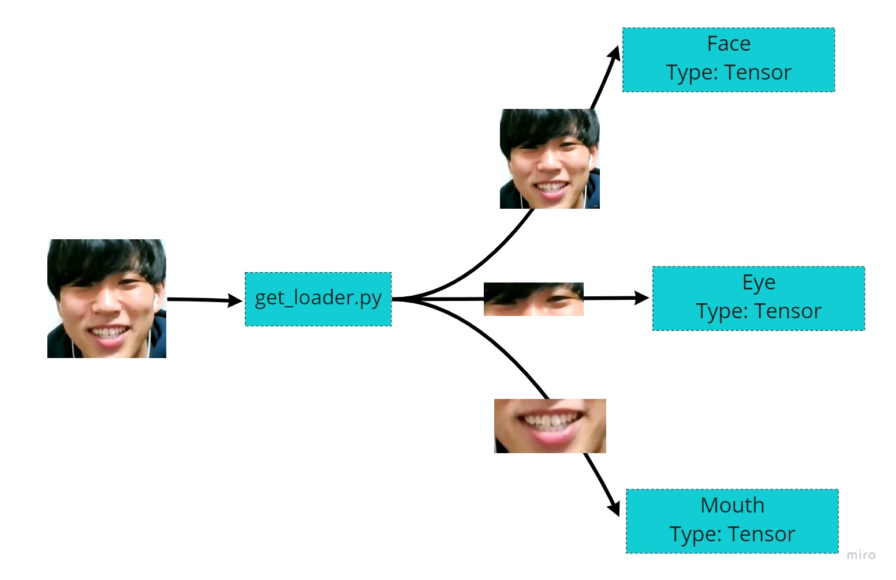
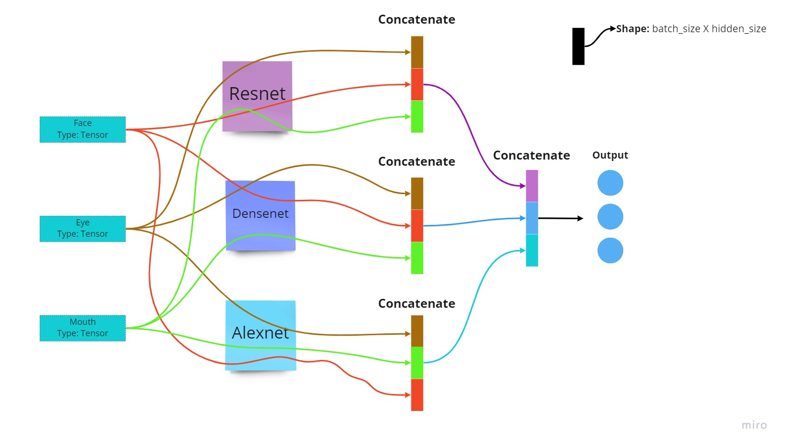
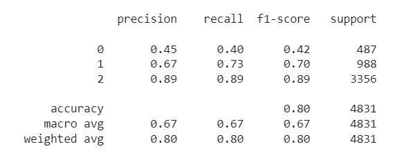

# SmileClassification

### Quick start
##### Step 1: Clone the repository
##### Step 2: Download([link](https://drive.google.com/drive/folders/1YZj1F3MhD7kdyc2LBm4YZYPZK1giAIk2?usp=sharing)) and move all the images to the "./data/happy_images" folder
##### Step 3: Download([link](https://drive.google.com/drive/folders/1VSEmSSFgvHCBzf9MnyICY4lE80eUAdDA?usp=sharing)) and move the pretrained weights to "checkpoint" folder

Now you are ready,

To Train the model
```
python train.py
```
To Test the model
```
python test.py
```

### Data preprocessing:
#### File: get_loader.py
  At first, I tried to train the model with raw input images, but the resulting accuracy is not ideal. Therefore, I tried to extract import features of the images(eye and mouth).
  1) Resized original images are feeded to Open CV Haarcascades pretrained model to extract the images of eye and mouth.
  2) Applied data augmentation to the images(face, eye, mouth)
  3) Created a custom dataset to load the data as tuple of (face, eye, mouth, target) tensors.


### Model Architecture
#### File: model.py
  At first, I tried using a single pretrained model, but the F1-score for negative smile is not ideal. Therefore I ensembled feature vectors extracted from 3 different pretrained models and feed it to the training loop.
  1) Each model trains 3 images(face, eye, mouth) separately to get the feature vector of shape batch_size x hidden_size.
  2) Then the feature vectors are concatenated and feeded to linear layer to get the vector of shape batch_size x hidden_size
  3) Vectors from 3 different models are again concatenated and feeded to a linear layer to finally get the output vector of shape batch_size x 3
  4) Pretrain models used: ResNet50, DenseNet201, AlexNet
  5) Loss function used: Cross Entropy Loss
  6) Optimizer used: Adam Optimizer


### Evaluation Metrics
After running the model to 40 epochs, this is the classification report.

